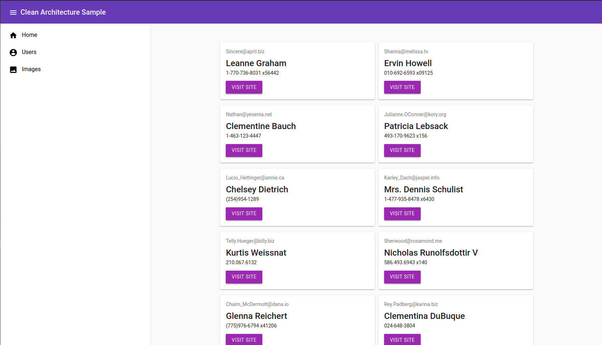

# AngularCleanArchDemo
This is a simple web application that consumes the [JsonPlaceHolder](https://jsonplaceholder.typicode.com/)

The application has included [Clean Architecture by Uncle Bob](https://www.oreilly.com/library/view/clean-architecture-a/9780134494272/) that guides in separation of concerns for easier testing and debugging.

## Tools
The application has been built with the following:

* Technologies
    
    * [Angular 12.+](https://angular.io/)
    * [Typescript](https://www.typescriptlang.org/)
    * [HTML 5](https://en.wikipedia.org/wiki/HTML5)
    * [JavaScript](https://developer.mozilla.org/en-US/docs/Web/JavaScript)
    * [NodeJS](https://nodejs.org/en/)
    * [RxJS](https://rxjs.dev/)
    * [Angular Material](https://material.angular.io/)
    * [MaterializeCSS](https://materializecss.com/)
    * [Material Design](https://material.io/)

* Application Architecture

    * Clean Architecture + MVC

## Screenshots

HOME | USERS | IMAGES
---- | ----- | ------ 
 |  | 

